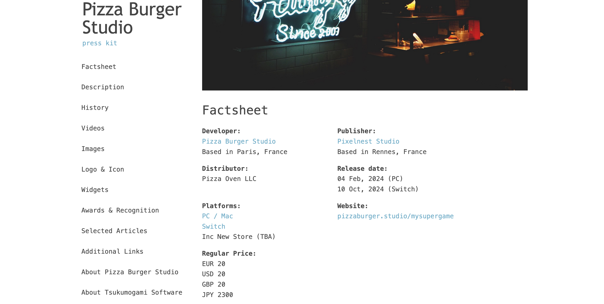

# 🐶 Milou a static press kit



Milou is a static site generator which helps you create beautiful and informative press kits to showcase your company and products to the press.
Milou lets you present your brand story, press releases, media assets, and key team members in a structured and engaging manner.

## Features

* *Static site generation*: Milou generates static HTML files, with fast-loading times, accessibility by default, and responsive design
* *YAML configuration*: Simple and human readable configuration format
* *Boilerplate templates*: Let Milou give you a template configuration and fill in the blanks with your content

## Showcase

* [Dice'n Goblins press kit](https://tsukumogami.software/press/dicengoblins/)

## Getting started

### Installation

You will need a terminal and [Node.js](https://nodejs.org/en/download/package-manager).

Install Milou using npm:

```shell
npm install -g milou
```

### Company

Create a new directory containing your company data:
```shell
mkdir mypresskit
cd mypresskit
milou new
```

The root directory of your project contains your company data.
You should present your company by filling the generated `data.yml` file in this directory.
You can use this [example](https://github.com/Tsukumogami-Software/milou/blob/main/data/data.yml) of a completed company `data.yml` file as a reference.

You should put images for your company in the `images` subfolder.
Images named `header.*` (e.g. `header.png` or `header.jpg`) will be used in the page header.
Files prefixed by `logo` (e.g. `logo01.png` or `logo.jpg`) will be put in the logos section of your page.
Any other image in this folder will be included as an image in the generated press kit.

### Product

Create a new sub-directory containing a product:
```shell
mkdir myproduct
cd mypresskit
milou new -t product
```

The product folders will contain data for your software, games or any other kind of products.
Like for companies, write your content in the generated `data.yml` file in this directory.
You can this [example](https://github.com/Tsukumogami-Software/milou/blob/main/data/product/data.yml) file as a reference.

Images should also be included in the new `images` subfolder.

### Build

Your project should now look like this:

```
📄 data.yml
📂 images/
  📄 header.png
  📄 logo.png
📂 myproduct/
  📄 data.yml
  📂 images/
    📄 header.png
    📄 logo.png
    📄 screenshot1.png
    📄 screenshot2.png
```

From the root directory of your project, you can now build your static site:
```
milou build .
```

This will output the static HTML, CSS and images in the `build` folder.
You can now start a web server to serve your content:

```
cd build
npx serve
```

Upload this folder to any static site host (GitHub pages, Netlify, CloudFlare pages, etc...) to make your presskit accessible by the whole world.

## Command line reference

```
milou new [options] <destination>

Create an empty `data.yml` file and its `images/` folder in the <destination> folder (current working directory by default).

  There are two template types available: company (default) or product.

Options:
  -V, --version         output the version number
  -t, --type [company]  set the type of the new `data.xml` file (default: "company")
  -h, --help            display help for command
```

```
milou build [options] <entry point>

Generate a presskit based on information found in `data.yml` files.

Options:
  -V, --version               output the version number
  -o, --output [destination]  output the build folder to the [destination] (defaults to ./build) (default: "/Users/alicegg/Code/mypresskit/myproduct/build")
  -w, --watch                 watch project for changes and re-generate if needed
  -d, --dev                   add monitoring of CSS and templates in watch mode
  -p, --port [8080]           set the server port to [8080] (default: 8080)
  -D, --clean-build-folder    delete the build folder beforehand
  -T, --ignore-thumbnails     use original images in galleries instead of thumbnails (will increase pages size)
  -h, --help                  display help for command
```

## Credits

### [Pixelnest/presskit.html](https://github.com/pixelnest/presskit.html)

Milou was forked from presskit.html, made by [Pixelnest Studio](http://pixelnest.io/).

### [presskit()](http://dopresskit.com)

Presskit.html was inspired by presskit(), made by [Rami Ismail](https://twitter.com/tha_rami).
